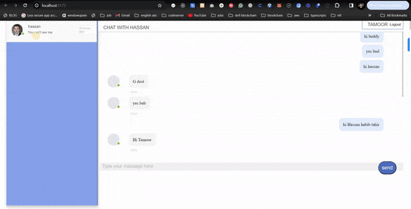
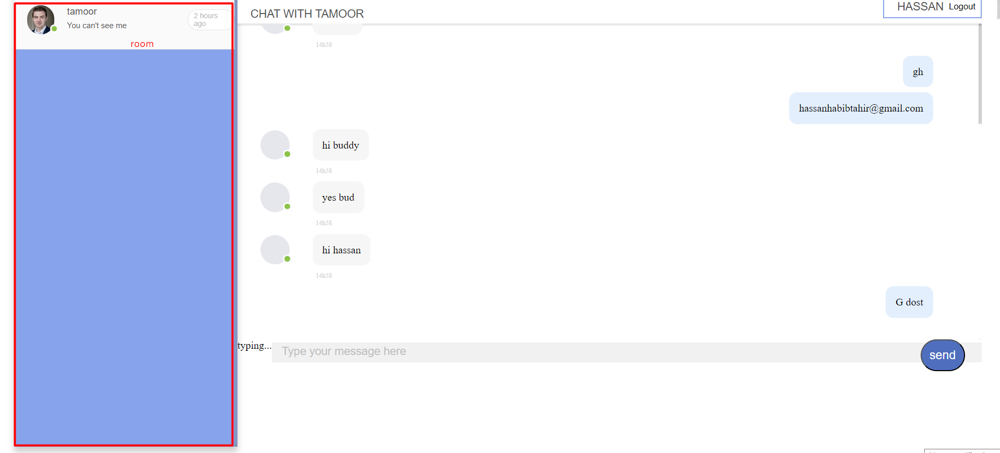
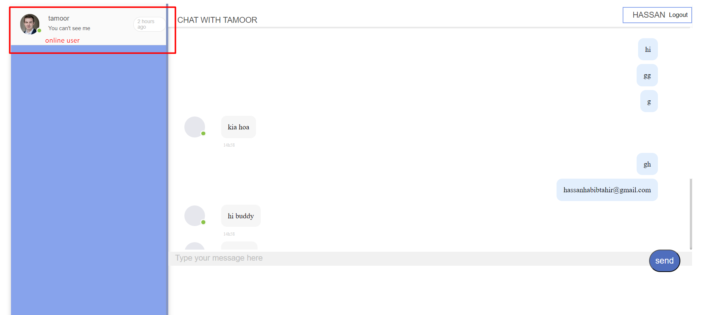
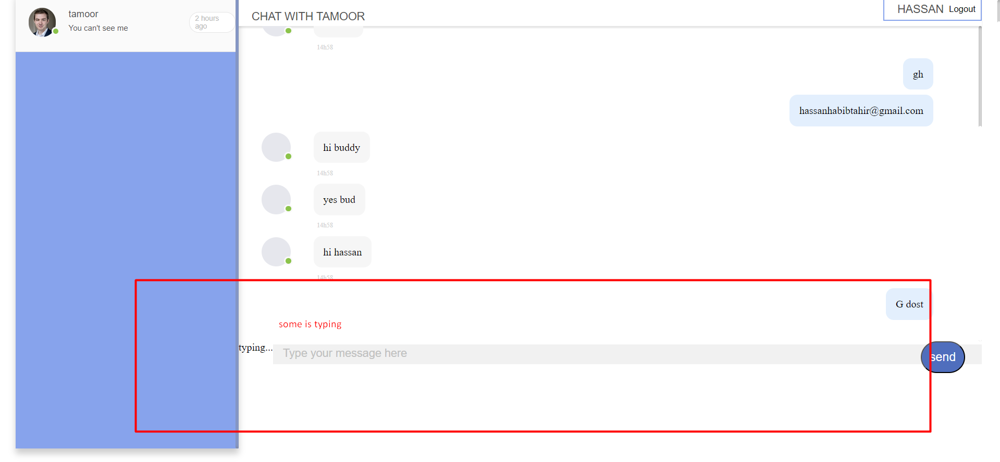
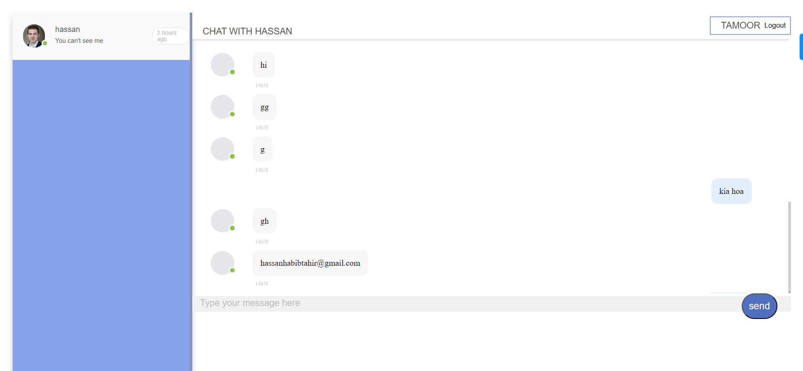
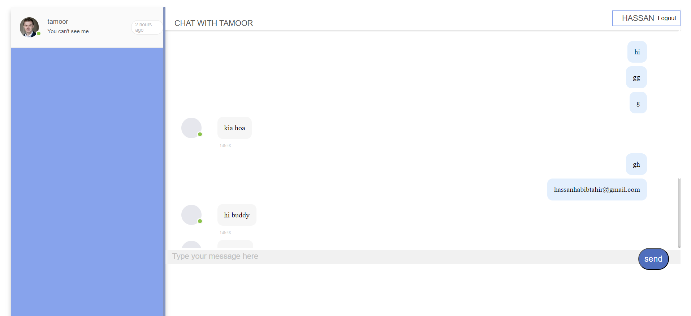

##  real-time chat application using Socket.io
● Multiple rooms: Users can join different rooms and send messages within those rooms.
● Private messages: Allowing users to send private messages to specific individuals within the same room.
● Typing indicator: Implement a feature that shows when a user is typing a message.
● Notifications: Notify users when someone joins or leaves the room.
● Message history: Store and display the last 10 messages exchanged in a room for new users joining.
### server
```bash
yarn install
yarn dev
```
### client
```bash
yarn install
yarn dev
```
### users
tamooriqbal37@gmail.com
tamoor123
hassanhabibtahir@gmail.com
12345678
muhammadaqibmasood@gmail.com
12345678






